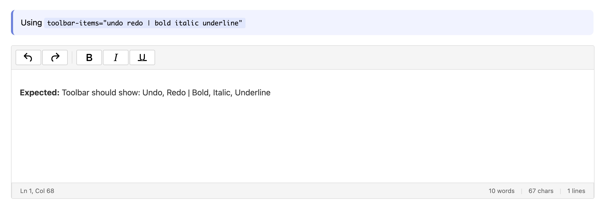
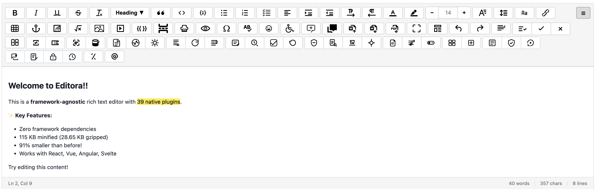
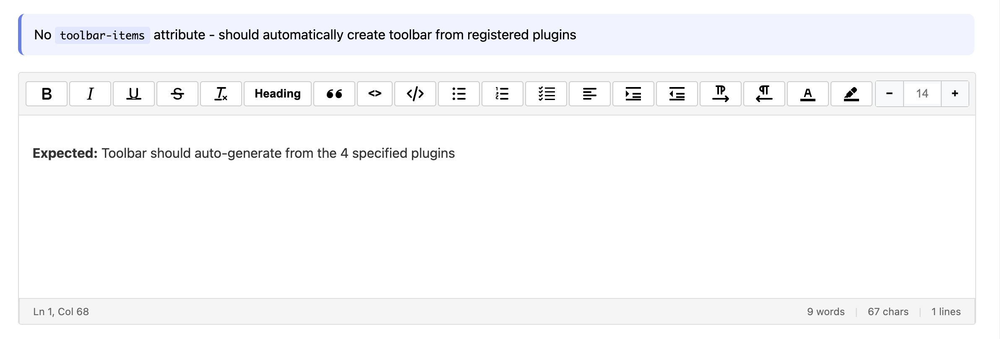
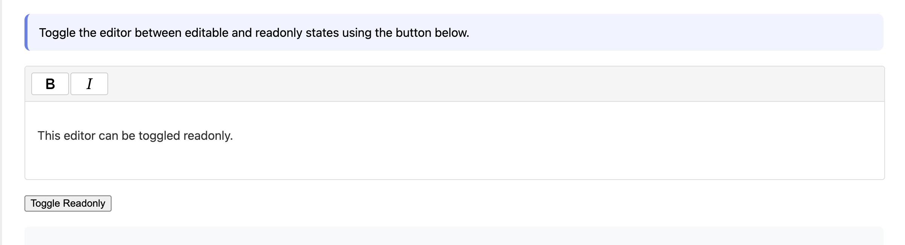
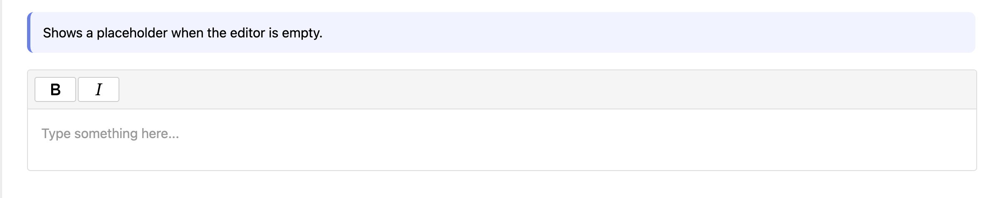
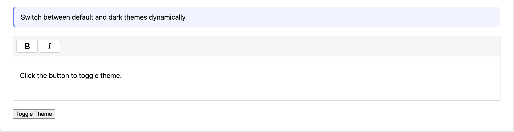
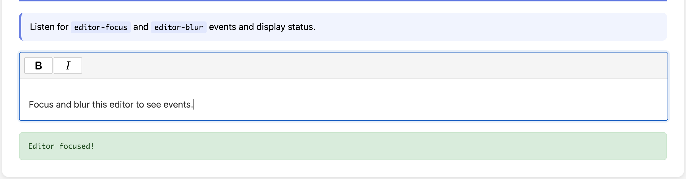
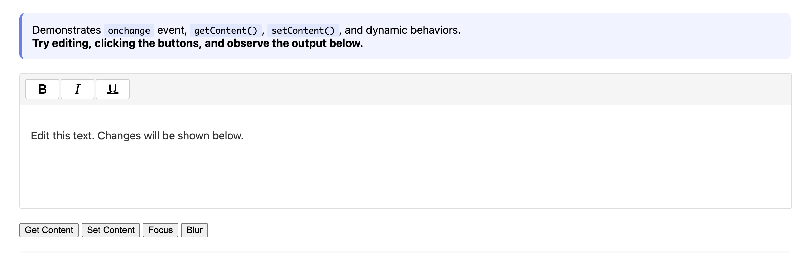
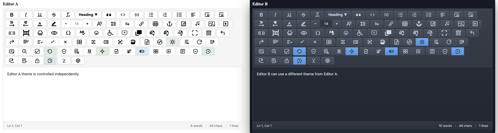

# Editora - Best Free Premium Rich Text Editor

<div align="center">
  
</div>

The **best free rich text editor** with enterprise-grade features. A comprehensive, production-ready WYSIWYG editor built with React, TypeScript, and modern web technologies. Get premium features completely free—no subscriptions, no limitations.

**🌐 [Try it Live](https://editora-free.netlify.app/)** | **🔗 [GitHub](https://github.com/ajaykr089/Editora)** | **📦 [NPM](https://www.npmjs.com/org/editora)**

**Free alternative to TinyMCE, Quill, Draft.js, and Slate.**

## 🚀 Why Editora? (Free Premium Features)

### ✨ Best Free Features
- **30+ Free Plugins**: Table editor, code highlighting, accessibility checker, media manager, and more
- **33+ Keyboard Shortcuts**: Professional editing speed
- **Enterprise-Grade**: Security, performance, accessibility (WCAG compliant)
- **Open Source**: MIT licensed, completely free forever
- **No Subscriptions**: No paywalls, no limitations, no hidden costs

### Core Editing
- ✅ **Rich Text Formatting**: Bold, italic, underline, strikethrough
- ✅ **Headings**: H1-H6 with proper semantic structure
- ✅ **Lists**: Ordered and unordered lists with nesting
- ✅ **Blockquotes**: Quoted content blocks
- ✅ **Links**: URL management with validation
- ✅ **Images**: Upload with validation and controls
- ✅ **Tables**: Full table editing with resize and merge
- ✅ **Code Blocks**: Syntax highlighting for 30+ languages
- ✅ **History**: Undo/redo with configurable depth
- ✅ **Status Bar**: Real-time cursor position, word/character counts, and selection info

### Enterprise Features (All Free)
- ✅ **Security**: XSS protection, HTML sanitization, content validation
- ✅ **Performance**: Transaction batching, memory management, monitoring
- ✅ **Theming**: CSS variables, light/dark themes, runtime switching
- ✅ **Accessibility**: WCAG compliance, keyboard navigation, a11y checker
- ✅ **TypeScript**: Full type safety and IntelliSense
- ✅ **Framework Agnostic**: Core works with any framework

### Developer Experience
- ✅ **Plugin Architecture**: Everything is modular and extensible
- ✅ **Clean APIs**: Intuitive hooks and component interfaces
- ✅ **Modern Stack**: React 18, TypeScript 5, modern build tools
- ✅ **Tree Shaking**: Optimized bundle sizes
- ✅ **SSR Compatible**: Next.js and server-side rendering support

## 📸 Features Overview

<div align="center">
  
  
  <br>
  
  
  <br>
  
  
  <br>
  
  
</div>

## 📦 Installation

```bash
npm install @editora/react @editora/plugins @editora/themes
```

## 🏗️ Architecture

### Package Structure
```
packages/
├── core/              # Framework-agnostic editor engine
├── react/             # React integration layer
├── plugins/           # 11 modular plugins
│   ├── bold/         # Text formatting
│   ├── italic/
│   ├── heading/
│   ├── paragraph/
│   ├── history/      # Undo/redo
│   ├── list/         # Bullet/numbered lists
│   ├── blockquote/
│   ├── table/        # Advanced tables
│   ├── image/        # Upload & management
│   ├── link/         # URL management
│   ├── codeblock/    # Syntax highlighting
├── themes/           # Theming system
└── performance/      # Optimization utilities
```

### Core Concepts

#### Plugin-First Architecture
Everything is a plugin - from basic formatting to advanced features. This ensures:
- **Modularity**: Easy to add/remove features
- **Maintainability**: Isolated concerns
- **Extensibility**: Custom plugins without core changes
- **Performance**: Lazy loading and tree shaking

#### Immutable State Management
- **Transaction-Based**: All changes are atomic
- **Structural Sharing**: Efficient memory usage
- **Undo/Redo**: Built-in history management
- **Collaboration Ready**: CRDT-compatible architecture

#### Schema-Driven Content
- **AST-Based**: Documents as JSON-serializable trees
- **Type Safety**: Runtime validation
- **Extensibility**: Custom node and mark types
- **Serialization**: HTML ↔ JSON conversion

## 💻 Usage

### Basic Setup

```typescript
import { EditoraEditor } from '@editora/react';
import "@editora/themes/theme.css";
OR
import "@editora/themes/themes/default.css";
import {
  BoldPlugin,
  ItalicPlugin,
  HeadingPlugin,
  HistoryPlugin
} from '@editora/plugins';

function MyEditor() {
  const [content, setContent] = useState('<p>Start writing...</p>');

  return (
    <EditoraEditor
      value={content}
      onChange={setContent}
      plugins={[
        BoldPlugin(),
        ItalicPlugin(),
        HeadingPlugin(),
        HistoryPlugin()
      ]}
    />
  );
}
```

### Status Bar Configuration

Editora includes a comprehensive status bar that displays real-time editing information.

```typescript
function EditorWithStatusBar() {
  return (
    <EditoraEditor
      statusbar={true}
      plugins={[
        BoldPlugin(),
        ItalicPlugin(),
        HeadingPlugin(),
        HistoryPlugin()
      ]}
    />
  );
}
```

#### Status Bar Features
- **Left Section**: Cursor position (Ln X, Col Y) and selection information
- **Right Section**: Word count, character count, and line count
- **Real-time Updates**: Information updates as you type and move the cursor
- **Selection Tracking**: Shows selected character and word counts when text is selected

#### Web Component Status Bar

```html
<editora-editor
  statusbar="true"
  plugins="bold italic underline history"
  toolbar-items="bold italic underline | undo redo"
>
  <p>Start editing to see status bar updates...</p>
</editora-editor>
```

### Advanced Configuration

```typescript
import { EditoraEditor } from '@editora/react';
import { MediaManagerPlugin, TablePlugin } from '@editora/plugins';
import { createPerformanceMonitor } from '@editora/performance';

const mediaPlugin = MediaManagerPlugin({
  uploadUrl: '/api/upload',
  maxSize: 5 * 1024 * 1024, // 5MB
  allowedTypes: ['image/jpeg', 'image/png']
});

const tablePlugin = TablePlugin();
const monitor = createPerformanceMonitor();

function AdvancedEditor() {
  return (
    <EditoraEditor
      plugins={[mediaPlugin, tablePlugin]}
      onInit={(editor) => {
        // Performance monitoring
        monitor.startOperation('editor-init');
        monitor.endOperation();
      }}
    />
  );
}
```

### Web Component Usage

Editora provides a framework-agnostic web component that works with any JavaScript framework or vanilla HTML.

```html
<!DOCTYPE html>
<html>
<head>
  <meta charset="UTF-8">
  <title>Editora Web Component</title>
  <script src="https://cdn.jsdelivr.net/npm/@editora/core/dist/webcomponent.min.js"></script>
  <link rel="stylesheet" href="https://cdn.jsdelivr.net/npm/@editora/core/dist/webcomponent.min.css">
</head>
<body>
  <editora-editor
    plugins="bold italic underline history"
    toolbar-items="bold italic underline | undo redo"
    height="300"
  >
    <p>Start editing your content here...</p>
  </editora-editor>

  <script>
    // Access the editor programmatically
    const editor = document.querySelector('editora-editor');
    
    // Get content
    const content = editor.innerHTML;
    
    // Set content
    editor.innerHTML = '<p>New content</p>';
    
    // Get API for advanced operations
    const api = editor.getAPI();
    if (api) {
      console.log('Editor content:', api.getContent());
    }
  </script>
</body>
</html>
```

#### Web Component Attributes

- `plugins`: Space-separated list of plugin names (e.g., "bold italic underline history")
- `toolbar-items`: Space-separated toolbar configuration with `|` for groups
- `height`: Editor height in pixels
- `placeholder`: Placeholder text when editor is empty

#### Available Plugins

All 37+ native plugins are available: `bold`, `italic`, `underline`, `strikethrough`, `link`, `table`, `list`, `history`, `heading`, `blockquote`, `code`, `textColor`, `backgroundColor`, `fontSize`, `fontFamily`, `textAlignment`, `indent`, `image`, `anchor`, `embedIframe`, `math`, `specialCharacters`, `emojis`, `a11yChecker`, `comments`, `fullscreen`, and more.

## 🌐 Web Component Demo

<div align="center">
  
  <p><em>Editora Web Component - Framework Agnostic Rich Text Editing</em></p>
</div>

```typescript
import '@editora/themes'; // Base theme
import '@editora/themes/dark.css'; // Dark theme
import { setGlobalTheme } from '@editora/themes';

// Apply dark theme
setGlobalTheme('dark');
```

## 🎨 Theme Comparison

<div align="center">
  
  <p><em>Editora supports both light and dark themes with seamless switching</em></p>
</div>

### Security Integration

```typescript
import { defaultSanitizer, ContentValidator } from '@editora/core';

// Sanitize user input
const cleanContent = defaultSanitizer.sanitize(userInput);

// Validate content
const validation = ContentValidator.validateText(cleanContent);
if (!validation.valid) {
  console.warn('Security warnings:', validation.warnings);
}
```

## 🔌 Plugin API

### Creating Custom Plugins

```typescript
import { Plugin } from '@editora/core';

const myCustomPlugin: Plugin = {
  name: 'my-plugin',
  nodes: {
    highlight: {
      attrs: { color: { default: 'yellow' } },
      parseDOM: [{ tag: 'mark' }],
      toDOM: (mark) => ['mark', { style: `background: ${mark.attrs.color}` }, 0]
    }
  },
  commands: {
    toggleHighlight: (state, dispatch) => {
      // Implementation
      return true;
    }
  },
  toolbar: [{
    id: 'highlight',
    icon: '🖍️',
    label: 'Highlight',
    command: 'toggleHighlight'
  }],
  keybindings: {
    'Mod-Shift-H': 'toggleHighlight'
  }
};
```

## 🔌 Plugin Architecture

<div align="center">
  
  <p><em>Modular Plugin System - Everything is a Plugin</em></p>
</div>
```

## 🎨 Customization

### CSS Variables

```css
:root {
  --rte-color-primary: #007bff;
  --rte-color-text-primary: #212529;
  --rte-font-family-base: 'Inter', sans-serif;
  /* 30+ customizable variables */
}
```

### Plugin Configuration

```typescript
const imagePlugin = createImagePlugin({
  uploadUrl: '/api/upload',
  maxSize: 10 * 1024 * 1024,
  allowedTypes: ['image/jpeg', 'image/png', 'image/webp'],
  uploadFunction: async (file) => {
    // Custom upload logic
    return await uploadToCloud(file);
  }
});
```

## 🚀 Performance

### Optimization Features
- **Transaction Batching**: Group multiple operations
- **Debounced Updates**: UI responsiveness optimization
- **Memory Management**: Automatic cleanup and monitoring
- **Virtual Scrolling**: Large document support
- **Lazy Loading**: Plugin loading on demand

### Monitoring

```typescript
import { createPerformanceMonitor } from '@editora/performance';

const monitor = createPerformanceMonitor();

// Track operations
monitor.startOperation('render');
// ... operation
const metrics = monitor.endOperation();

console.log('Render time:', metrics.renderTime, 'ms');
console.log('Memory usage:', metrics.memoryUsage, 'MB');
```

## ⚡ Performance Monitoring

<div align="center">
  
  <p><em>Built-in Performance Monitoring and Optimization</em></p>
</div>

## 🔒 Security

### Built-in Protections
- **HTML Sanitization**: Configurable tag/attribute filtering
- **URL Validation**: Protocol and domain checking
- **File Upload Security**: Size and type validation
- **XSS Prevention**: Content validation and filtering
- **DoS Protection**: Nesting and size limits

### Content Validation

```typescript
import { ContentValidator } from '@editora/core';

// Validate text content
const result = ContentValidator.validateText('<script>alert(1)</script>');
// result.valid = false, warnings include XSS detection

// Validate file uploads
const fileResult = ContentValidator.validateFile(file, {
  maxSize: 5 * 1024 * 1024,
  allowedTypes: ['image/jpeg', 'image/png']
});
```

## 🧪 Testing

```bash
# Run all tests
npm test

# Run specific package tests
npm test -- packages/core

# Run with coverage
npm run test:coverage
```

## 📚 API Documentation

### Core Classes
- **`EditorState`**: Immutable editor state with transactions
- **`Schema`**: Document structure definition
- **`Plugin`**: Extensible plugin base class
- **`Transaction`**: Atomic state changes

### React Components
- **`EditoraEditor`**: Main editor component
- **`Toolbar`**: Configurable button groups
- **`EditorContent`**: ContentEditable area

### Hooks
- **`useEditor`**: Access editor state and dispatch
- **`useCommand`**: Execute commands programmatically
- **`useSelection`**: Track selection changes

## 🤝 Contributing

### Development Setup

```bash
# Clone repository
git clone https://github.com/your-org/Editora.git
cd Editora

# Install dependencies
npm install

# Start development
npm run dev

# Build packages
npm run build

# Run tests
npm test
```

### Plugin Development
1. Create plugin package in `packages/plugins/`
2. Implement plugin class extending base `Plugin`
3. Add schema extensions, commands, toolbar items
4. Write tests and documentation
5. Submit pull request

## 📄 License

MIT License - see [LICENSE](LICENSE) file for details.

## 🙏 Acknowledgments

Built with modern web technologies:
- **React 18** - UI framework
- **TypeScript 5** - Type safety
- **Rollup** - Module bundling
- **Jest** - Testing framework
- **Lerna** - Monorepo management

Inspired by modern editor architecture and best practices.

---

## 📞 Support

- **Documentation**: [docs.rte-editor.com](https://editora-free.netlify.app/)
- **Issues**: [GitHub Issues](https://github.com/your-org/Editora/issues)
- **Discussions**: [GitHub Discussions](https://github.com/your-org/Editora/discussions)

---

**Rich Text Editor** - Enterprise-grade editing for modern web applications.