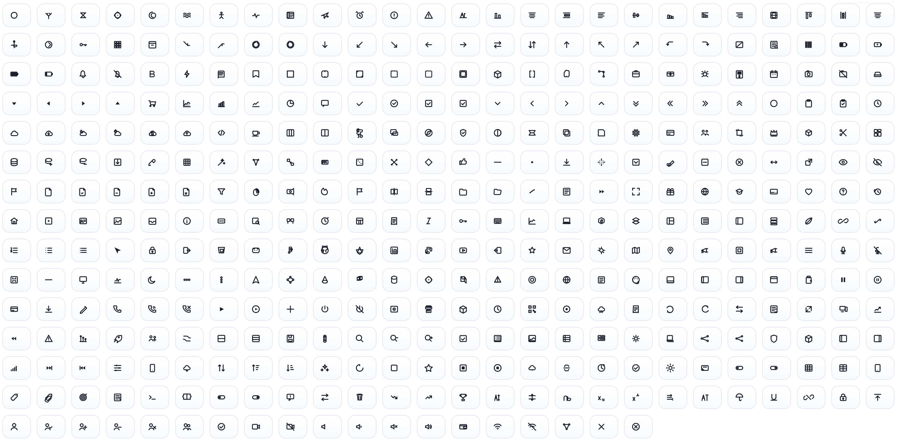

# @editora/icons

Framework-agnostic SVG icon library for the Editora UI ecosystem.

Use this package when you need:
- raw icon definitions and registry APIs,
- SVG string rendering in any framework/runtime,
- icon aliases and runtime extension,
- bridge support to register icons into `@editora/ui-core`.

<div align="center">
  
</div>

## Installation

```bash
npm install @editora/icons
```

## Quick Start

```ts
import { renderIconSvg, listIcons } from '@editora/icons';

const svg = renderIconSvg('check', {
  variant: 'outline',
  size: 16,
  color: 'currentColor',
  strokeWidth: 1.5,
  decorative: true
});

console.log(svg);
console.log(listIcons().slice(0, 10));
```

## Package Exports

### Definitions + registry
- `iconDefinitions`
- `iconNameList`
- `getIcon(name)`
- `hasIcon(name)`
- `listIcons()`
- `listIconAliases()`
- `registerIcon(definition)`
- `registerIcons(definitions)`
- `resolveIcon(name, variant?)`

### Rendering
- `renderIconSvg(name, options?)`
- `iconToDataUri(name, options?)`

### Integration helper
- `registerWithEditoraUI(registerFn)`

### Types
- `IconDefinition`
- `IconGlyph`
- `IconNode`
- `IconRenderOptions`
- `IconVariant`
- `ResolvedIcon`
- `IconTag`
- `IconAttrValue`

## Core Concepts

### 1) Names and normalization

Icon names are normalized internally:
- lowercase
- spaces/underscores converted to `-`

So `"Chart Line"`, `"chart_line"`, and `"chart-line"` resolve to the same key pattern.

### 2) Variants

Supported variants:
- `outline` (default fallback)
- `solid`
- `duotone`

If a requested variant is missing, the renderer automatically falls back to `outline`.

### 3) Aliases

Definitions can include `aliases`. `getIcon` and `resolveIcon` check aliases automatically.

## API Usage

### Registry lookup

```ts
import { hasIcon, getIcon, resolveIcon, listIconAliases } from '@editora/icons';

if (hasIcon('navigation')) {
  const def = getIcon('navigation');
  const resolved = resolveIcon('navigation', 'duotone');
  console.log(def?.name, resolved?.variant);
}

console.log(listIconAliases());
```

### Render SVG string

```ts
import { renderIconSvg } from '@editora/icons';

const svg = renderIconSvg('chart-line', {
  variant: 'duotone',
  size: 20,
  color: 'var(--ui-fg)',
  secondaryColor: 'var(--ui-fg-muted)',
  strokeWidth: 1.5,
  strokeLinecap: 'round',
  strokeLinejoin: 'round',
  title: 'Revenue trend'
});
```

### Render as Data URI

```ts
import { iconToDataUri } from '@editora/icons';

const uri = iconToDataUri('check-circle', {
  size: 14,
  color: '#16a34a',
  decorative: true
});

// Example: CSS background-image
// background-image: url("${uri}");
```

## `IconRenderOptions`

Common options for `renderIconSvg` and `iconToDataUri`:

| Option | Type | Default | Notes |
|---|---|---|---|
| `variant` | `'outline' \| 'solid' \| 'duotone'` | `'outline'` | Falls back to `outline` when unavailable. |
| `size` | `number \| string` | `15` | Sets SVG `width`/`height`. |
| `color` | `string` | `'currentColor'` | Primary color. |
| `secondaryColor` | `string` | `color` | For duotone secondary paths. |
| `strokeWidth` | `number` | `1.5` | Stroke thickness. |
| `absoluteStrokeWidth` | `boolean` | `false` | Keeps perceived stroke width stable across sizes. |
| `strokeLinecap` | `'butt' \| 'round' \| 'square'` | `'round'` | Applied when stroke exists. |
| `strokeLinejoin` | `'miter' \| 'round' \| 'bevel'` | `'round'` | Applied when stroke exists. |
| `title` | `string` | `undefined` | Adds `<title>`. |
| `ariaLabel` | `string` | inferred | Accessibility label for semantic icons. |
| `decorative` | `boolean` | inferred | If `true`, outputs `aria-hidden`/presentation role. |
| `rotate` | `number` | `0` | Rotation in degrees. |
| `flip` | `'horizontal' \| 'vertical' \| 'both'` | `undefined` | Flip transform. |
| `rtl` | `boolean` | `false` | Mirrors icons marked `rtlMirror`. |
| `className` | `string` | `undefined` | Applied on root `<svg>`. |
| `style` | `string` | `undefined` | Inline style text on root `<svg>`. |
| `attrs` | `Record<string, ...>` | `undefined` | Extra root attributes (`data-*`, etc.). |

## Register Custom Icons

You can extend the registry at runtime.

```ts
import { registerIcon, renderIconSvg, type IconDefinition } from '@editora/icons';

const CustomBillingIcon: IconDefinition = {
  name: 'billing-custom',
  aliases: ['billing-custom-outline'],
  tags: ['finance', 'invoice'],
  categories: ['business'],
  viewBox: '0 0 15 15',
  variants: {
    outline: {
      nodes: [
        { tag: 'rect', attrs: { x: 2, y: 1.5, width: 11, height: 12, rx: 2, fill: 'none', stroke: 'currentColor' } },
        { tag: 'line', attrs: { x1: 4, y1: 5, x2: 11, y2: 5, stroke: 'currentColor' } },
        { tag: 'line', attrs: { x1: 4, y1: 8, x2: 9.5, y2: 8, stroke: 'currentColor' } }
      ]
    }
  }
};

registerIcon(CustomBillingIcon);

console.log(renderIconSvg('billing-custom'));
```

Register many icons:

```ts
import { registerIcons } from '@editora/icons';

registerIcons([/* IconDefinition[] */]);
```

## Integrations

### With `@editora/react-icons`

`@editora/react-icons` consumes this package for React components and typed name APIs.

### With `@editora/ui-core`

Use the built-in bridge to register all available icons into a UI core icon registry.

```ts
import { registerWithEditoraUI } from '@editora/icons';

// registerFn(name, svg) should add icon markup into your UI icon store.
registerWithEditoraUI((name, svg) => {
  console.log('registered', name, svg.length);
});
```

## Accessibility Notes

- Decorative icons should use `decorative: true` (or omit `title`/`ariaLabel` so it is inferred).
- Semantic icons should provide `title` or `ariaLabel`.

## Performance Notes

- `@editora/icons` is `sideEffects: false` for tree-shaking.
- Prefer reusing resolved icon names in app code instead of repeated normalization in hot loops.
- For large CSS/icon sprites, `iconToDataUri` can be cached by `(name, variant, size, color)` keys.

## Development

```bash
cd packages/icons
npm run build
```

## Troubleshooting

- Empty SVG returned:
  - Icon name is missing or misspelled.
  - Requested variant is unavailable and definition has no usable outline.
- Alias not resolving:
  - Verify alias is registered in the icon definition.
- Unexpected stroke/fill:
  - Check custom node attrs and variant nodes for `fill`/`stroke` overrides.
